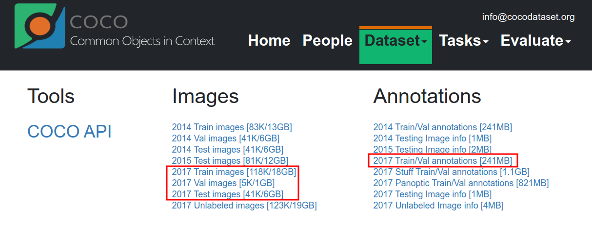

# Calculate mAP after learning using COCO Dataset

COCO Dataset을 가지고 학습 시킨 후 mAP 계산해보기 

작성자 : 진대종 ([github](https://github.com/jdj2261))

> Environment
>
> - Ubuntu Version : 18.04
> - CUDA Version : 11.0
> - CuDNN Version : 7.6.4

## 1. COCO DataSet 다운로드

- [coco dataset 다운로드](https://cocodataset.org/#download)
- [블로그 참고](https://eehoeskrap.tistory.com/367)

## 2. Annotation 변환

- coco data annotation은 json 포맷으로 되어있으므로 Yolo 포맷인 Text 형식으로 변환해야 한다.

- COCO 데이터 포맷은 bbox 값이 x, y ,w, h 값으로 구성되어있지만

  Yolo 포맷은 클래스 번호와 전체 영상 크기에 대한 center x, center y, w, h 비율 값으로 구성된다.

  >example
  >
  >> COCO Format  : 0  279.53 480, 352.53
  >> Yolo     Format  : 0 0.256 0.315 0.506 0.593

- Convert2Yolo 깃허브 다운로드

  ~~~
  $ git clone https://github.com/ssaru/convert2Yolo.git
  ~~~

  - 아래와 같은 데이터들의 주석 파일을 Yolo 프레임워크에 맞게 변환 할 수 있다.

    - COCO
    - VOC
    - UDACITY Object Detection
    - KITTI 2D Object Detection

  - 필자는 coco.names를 생성하고, COCO 데이터 세트 중 val2017 주석 파일들을 yolo 형식에 맞춰 변경하였다.

    ~~~
    $ python3 example.py 
    --datasets COCO 
    --img_path ~/Downloads/coco/val2017/ 
    --label coco/annotations_trainval2017/annotations/instances_val2017.json 
    --convert_output_path coco/output/
    --img_type ".jpg" 
    --manifest_path ./ 
    --cls_list_file coco/coco.names 
    ~~~

    - **img_path** : val2017 이나 train2017 을 다운받은 폴더
    - **label** : 해당 데이터에 대한 주석 파일
    - **convert_output_path** : txt 파일들을 저장할 공간 (디렉토리를 만들어야 한다.)
    - **img_type** : COCO 영상 확장자
    - **manipast_path** : 변환된 파일들의 리스트를 manipast.txt 로 저장할 폴더
    - **cls_list_file** : COCO 클래스 이름들이 담긴 파일 

  - 이 때 cls_list_file은 다음과 같은 리스트를 이용하였다.

    ~~~
    person
    bicycle
    car
    truck
    traffic light
    bird
    cat
    dog
    ~~~

  - 변경 후 000000000139.text 파일 일부 내역은 다음과 같다.

    ~~~
    None 0.39 0.416 0.039 0.163
    None 0.128 0.505 0.233 0.223
    None 0.934 0.583 0.127 0.185
    None 0.605 0.633 0.088 0.241
    None 0.503 0.627 0.097 0.231
    None 0.669 0.619 0.047 0.191
    None 0.513 0.528 0.034 0.027
    0 0.686 0.532 0.083 0.324
    0 0.612 0.446 0.024 0.084
    ~~~

  - 모든 annotation text 파일을 coco 이미지 경로 안으로 복사한다.

    darknet을 이용하려면 이미지 파일과 텍스트 파일이 같은 경로에 있어야 한다.

  - 각각의 텍스트 파일에 대하여 None이 담긴 줄을 제거해야 한다.

    None이 나오는 이유는 coco data는 80개 이상이지만 필자가 학습시킬려고 하는 클래스 개수는 8개이다

    convert2yolo를 하면 내가 class 파일에 지정하지 않은 객체 이름들은 None으로 바뀌게 된다.

    학습하는데 도움이 되지 않는 것들은 과감하게 지우고자 한다.

  - 아래의 파일은 모든 텍스트를 읽어서 None이 적혀있는 줄을 지우고 텍스트 파일 내용이 모두 지워져 있으면 해당 이미지도 지워버리는 코드이다. 

    해당 폴더 상위 디렉토리에 train.txt  파일이 생성되고 train.txt 파일엔 학습 시킬 이미지 경로가 담겨있다.

    [make_coco_train_text.py](https://github.com/jdj2261/DeepLearning_LIB) 

    ~~~
    $ python3 make_coco_train_text.py -mt ~/Documents/output
    ~~~

  - train.txt 파일 내용 일부를 valid.txt에 옮기려고 한다.

    같은 디렉토리 안에 valid.txt를 만들어 train.txt에 담긴 내용을 약 20퍼센트 정도 잘라내기 하여 붙인다.

    필자는 train과 valid set의 비율을 8:2 정도로 할 것이며, 안해도 문제는 없다. 안하면 검출율이 낮아진다고 한다.

## 3. Darknet 학습 준비하기

- coco.names, coco.data, yolov4.cfg 를 수정해야한다.

  수정하는 방법은 [블로그 참고 ](https://eehoeskrap.tistory.com/370?category=705416), [Darknet Github 참고](https://github.com/AlexeyAB/darknet/tree/master)

- coco 데이터를 학습하는데 도움을 주는 pretrained weights를 다운받아

  다운받은 darknet 디렉토리 안에 복사한다.

## 4. Training

- 학습시키는 명령어를 입력하여 실행시킨다.

  이때 자신이 만든 coco data, cfg file, weights file이 필요하며 학습 진행이 잘 되는지 그래프로 보기위해 끝에 -map 을 추가하면 된다.

  ~~~
  $ ./darknet detector train /home/djjin/Downloads/coco/coco.data /home/djjin/Downloads/coco/yolov4.cfg yolov4.conv.137 -map
  ~~~

## 5. 검출 결과 추출

- darknet 디렉토리에 result.txt로 해당 이미지 목록의 detection 결과를 추출한다.

  ~~~
  $ ./darknet detector test data/mycoco.data cfg/myyolov4.cfg backup/myyolov4_best.weights -dont_show -ext_output < data/train.txt > result.txt
  ~~~

- 명령어를 입력하면 darknet 디렉토리 안에 result.txt가 생성된다.

## 6. mAP 결과 보기

- [mAP tool 다운로드](https://github.com/Cartucho/mAP#create-the-detection-results-files) 

  ~~~
  $ git clone https://github.com/Cartucho/mAP
  ~~~

- darknet 폴더 안에 생성된 result.txt 파일을 이용하여 

  detection result 폴더 안에 파일 

### 6-1. detection result 생성

- mAP/scripts/extra 디렉토리로 들어가 convert_dr_yolo.py 를 실행시킨다

- 이 때, result.txt 파일을 수정해야 한다

  필자는 [AlexeyAB Darknet](https://github.com/AlexeyAB/darknet/tree/master)을 이용하여 Yolov4 모델의 result.txt 파일을 생성하였는데, mAP Issue를 보니 yolov3와 yolov4 모델에서 생성된 result.txt 결과가 조금 다르다고 한다. yolov3 결과에 맞게 변경해야 한다.

  "Enter Image Path: " 문자열 다음 .jpg 형태가 나와야 하는데 yolov4 결과를 보면 layer가 나오는 것을 볼 수 있다.

  - yolov4 결과

    ~~~ seen 64, trained: 224 K-images (3 Kilo-batches_64) 
    Enter Image Path:  Detection layer: 139 - type = 28 
     Detection layer: 150 - type = 28 
     Detection layer: 161 - type = 28 
    /home/djjin/Downloads/coco/val2017/000000000724.jpg: Predicted in 27.107000 milli-seconds.
    car: 44%	(left_x:  119   top_y:  281   width:   26   height:   26)
    truck: 87%	(left_x:  120   top_y:  280   width:   25   height:   30)
    Enter Image Path:  Detection layer: 139 - type = 28 
     Detection layer: 150 - type = 28 
     Detection layer: 161 - type = 28 
    /home/djjin/Downloads/coco/val2017/000000000785.jpg: Predicted in 28.613000 milli-seconds.
    ~~~

  - yolov3 결과

    ~~~
    Enter Image Path: /home/djjin/Downloads/coco/val2017/000000000724.jpg: Pred     icted in 27.107000 milli-seconds.
    car: 44%        (left_x:  119   top_y:  281   width:   26   height:   26)
    truck: 87%      (left_x:  120   top_y:  280   width:   25   height:   30)
    ~~~

- result.txt 파일 변환 후 mAP/scripts/extra 디렉토리 안으로 복사

  ~~~
  $ cd My_Python_LIB
  $ python3 convert_yolov4_result.py --convert_result result.txt path
  $ cp -r result.txt mAP/scipts/extra
  ~~~

- detection-result 디렉토리에 result.txt 목록에 저장되어 있는 txt파일 생성

  convert_dr_yolo.py에서 IN_FILE을  result.txt 파일이 있는 경로로 수정한다.

  ~~~
  $ cd mAP/scripts/extra
  $ python3 convert_dr_yolo.py
  ~~~

### 6-2. ground truth 생성

- mAP/scripts/extra 폴더 안에 class_list를 데이터의 객체이름으로 변경

  필자의 경우

  ~~~
  person
  bicycle
  car
  truck
  traffic_light
  bird
  cat
  dog                 
  ~~~

- input 디렉토리에 images 폴더 만들고 ground-truth 데이터와 images 데이터 이동

  ~~~
  # cd input && mkdir images
  $ cp ~/Downloads/coco/backpu/val2017/*.txt input/ground-truth
  $ cp ~/Downloads/coco/backpu/val2017/*.jpg input/images
  ~~~

- 이동 되었으면 다시 convert 파일 실행

  ~~~
  $ cd scripts/extra
  $ python3 convert_gt_yolo.py
  ~~~

- mAP/input/ground-truth 폴더 안에 backup 이란 폴더가 생성되면 convert 성공!

## 7. mAP 측정하기

- main.py 파일을 열어 50번째 줄 수정

  이미지가 담긴 디렉토리명 수정

  ~~~python
  # IMG_PATH = os.path.join(os.getcwd(), 'input', 'images-optional')
  IMG_PATH = os.path.join(os.getcwd(), 'input', 'images')
  ~~~

- main.py 실행

  ~~~
  $ python3 main.py
  ~~~

## 8. 결과보기

- 토핑별 AP 및 전체 mAP

  

